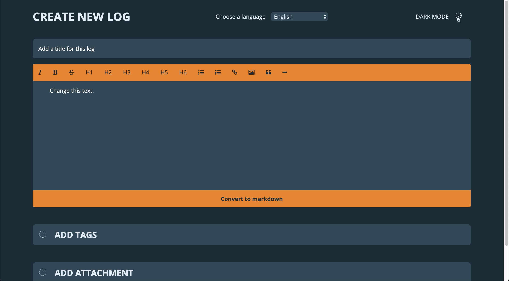

# prototyping-artikel_CMDA-Minor-Web

Veel ontwerpers zullen zichzelf hier in herkennen: Zodra je een idee hebt wil je dat zo snel mogelijk gaan uitwerken. Met deze methode hoeft eigenlijk niks mis mee te zijn natuurlijk. Mijn persoonlijke ontwerpprocessen beginnen exact zo, wanneer ik een idee in mijn hoofd heb waarvan ik niet direct weet hoe dit op te lossen is, ga ik zonder onderzoek te doen direct van start. Wanneer ik dan het doel bereikt heb qua prototype, kom ik er vaak achter dat iets misschien heel anders had gekund. In mijn geval begin ik pas te itereren zodra ik iets werkend heb in plaats van dat ik tijdens het werkproces al met een andere blik naar mijn product kijk. Echter heb ik in project 3 van de minor Web Development gekozen voor een andere aanpak.

Op het moment dat we als groep duidelijk bedacht hadden wat we gingen maken, ben ik voor mezelf gaan uitdenken hoe ik dit zou kunnen ontwikkelen. Het plan was namelijk om een What You See Is What You Get (ook wel WYSIWYG) editen te ontwikkelen. In eerste instantie was mijn idee om met een inputfield te werken waar de gebruiker in kon typen. Vervolgens was het idee om een div hier overheen te plaatsen en daar te output tekst in te laten zien. In dat geval lijkt het alsof je de tekst in een inputfield staat, maar is deze ook daarbuiten zichtbaar. Het voordeel hiervan zou zijn dat je styling kon toevoegen aan de tekst in de div. Het is niet mogelijk om de styling toe te voegen in een inputfield namelijk. Het nadeel hiervan? Het is super omslagtig en ik kon me haast niet voorstellen dat andere mensen dit ook op deze mannier in de praktijk zouden uitwerken.

Na een kort overleg hadden we een knoop doorgehakt, dit zou niet de mannier zijn waarop het moet gebeuren. Vervolgens heb ik iets moeten doen waar ik eigenlijk geen fan van was. Ik ben op zoek gegaan naar voorbeelden van WYSIWYG editors om te kijken hoe andere mensen dit hebben aangepakt. Voorheen kreeg ik altijd een vervelend gevoel zodra ik “aan het afkijken” was hoe iemand anders dit had opgelost. Echter na het uitspreken van mijn gevoel hier over werd me al snel duidelijk dat het niet nodig is het wiel opnieuw uit te vinden. Dit wilt niet zeggen dat je nu letterlijk een stuk code letterlijk moet kopiëren, maar meer kijken naar welke tools hier voor gebruikt zijn. Het juiste gereedschap gebruiken. “Wanneer een bouwvakker een unieke schuur in elkaar timmert, kan hij daar wel het gereedschap voor gebruiken die elke bouwvakker gebruikt.” Met die instelling voelde ik me al beter op mijn gemak om onderzoek te doen naar bestaande oplossingen. En juist door deze keuze ben ik er van overtuigd dat de beslissingen die ik genomen heb dat project, dat dit in het voordeel heeft gewerkt van het eindresultaat.

Door onderzoek te doen naar bestaande WYSIWYG editors en door te lezen op MDN ben ik op 2 zeer handige methodes gekomen. Als eerst ben ik tot de ontdekking gekomen dat de tag contenteditable bestaat. Wanneer deze tag wordt gegeven aan een bestaand html element, is het voor de gebruiker mogelijk om de content aan te passen die hierin staat. Het grote voordeel hiervan is dat de input nu wel gestyled kan worden waar dit niet kon in input Fields. Qua semantiek is dit wel een nadeel, een div, section, of een welk element dan ook is niet bedoelt voor het invoeren van content, op de input Fields na. Nadat ik hier achter gekomen was, was ik van plan om regex te gaan gebruiken om de styling gaan toe te voegen van een WYSIWYG editor. Echter was hier een beter idee voor dan dat ik in eerste instantie dacht.

Een betere oplossing hiervoor was om gebruik te maken van de functie ExecCommand. ExecCommand zorgt er voor dat een bepaald element wordt aangemaakt of wordt omgezet naar datgene wat jij wilt. Om een voorbeeld te geven van code:

```
document.execCommand('italic', false, '')
```

In dit voorbeeld wordt de geselecteerde tekst in een contenteditable element omgezet naar tekst die italic is. Er zijn hier 3 waardes aan meegegeven. De eerste waarde is het commando waar je het element naar omzet. De tweede waarde is een boolean waar je kan aangeven of de vooringestelde UI gebruikt moet worden. In dit voorbeeld is er voor false gekozen.Als laatste argument kan er een value meegegeven worden. Als je execCommand wilt gebruiken om een h1 te genereren, zou je in dat in de value moeten aangeven.
Het positieve aan ExecCommand is dat het door veel browsers goed wordt ondersteund. Ook heeft execCommand bijna 50 functies die je voor diverse doeleinden kan gebruiken.

Het eindresultaat van dit onderzoek is dan ook iets waar ik erg trots op ben. Ik heb in korte tijd een goed werkend prototype kunnen ontwikkelen en ben ervan overtuigd dat de aanpak die ik hier voor gebruikt heb de aanpak is die ik vaker moet gaan hanteren zodra ik iets ga maken wat ik niet eerder gedaan heb. Het zorgt ervoor dat ik minder tijd kwijt ben aan experimenten die uiteindelijk alleen tijdverlies gaan opleveren. Wel moet ik hier een balans in gaan vinden, zodat ik mezelf wel blijf uitdagen en niet alles van andere kan gaan overnemen.


